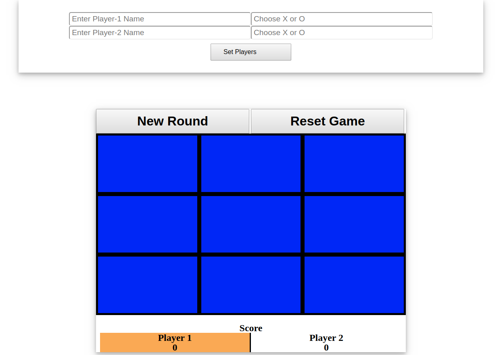

# Tic Tac Toe Project

> This project is a tic tac toe game.

This project has this characteristics:
  - Create objects using factory functions.
  - Use modules to prevent functions from being global.

## Built With

- HTML, CSS
- Javascript

## Settings

- Select a user name and a symbol.
- You can select any symbol you like.
- Becareful and don't select the same symbol for both players!

## Live Demo

[Live Demo Link](https://sumancrest0001.github.io/js-tic-tac-toe/)

## Authors

👤 **María Reyes**

- Github: [@majo_vanilla](https://github.com/majo_vanilla)
- Linkedin: [María José Reyes Parroquin](https://www.linkedin.com/in/majoreyesparroquin/)

👤 **Suman Shrestha**

- Github: [@sumancrest0001](https://github.com/sumancrest0001)

## 🤝 Contributing

Contributions, issues and feature requests are welcome!

Feel free to check the [issues page](https://github.com/sumancrest0001/js-tic-tac-toe/issues).

## Show your support

Give a ⭐️ if you like this project!

## Acknowledgments

- Final Project of the Rails Section from the [Microverse Curriculum] (https://www.microverse.org/)
- We follow the instructions of [The Odin Project](https://www.theodinproject.com/courses/javascript/lessons/tic-tac-toe-javascript)

## 📝 License

Feel free to fork this project and improve it.
